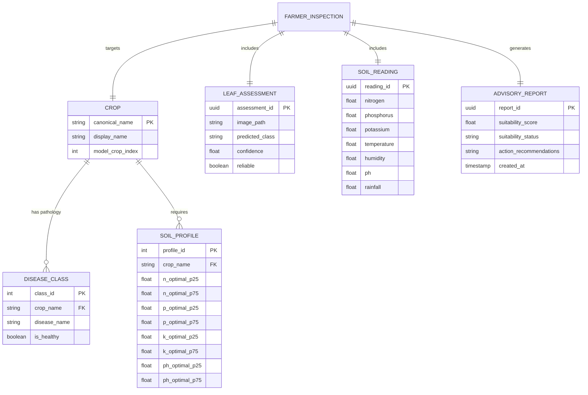

# 04 - Entity Relationship (ER) & Domain Data Models

## 1. Domain Entities
While the inference engine executes directly on serialized neural weights and tabular distributions, the logical data domain is modeled around agricultural records:

## 2. Model Persistence Strategy
- **Historical Soil Profiles**: Tabular CSV (`data/raw/crop_recommendation_10000.csv`) with caching.
- **Model Checkpoints**: Keras v3 native archive format (`.keras`) containing weights, optimizer state, and network topology.
- **Classes Manifest**: JSON mapping of integer indices to PlantVillage category labels.
